# docsfer

**PAC - Projeto de Aprendizagem Colaborativa Extensionista do Curso de Engenharia de Software da Católica de Santa Catarina.**

Autores:
- Henrique Maia Cardosa
- João Miguel de Castro Menna
- João Pedro Izidoro
- Nicolas Robert de Oliveira Borges
- Ricardo Gabriel Fialho Santos

Professores orientadores:
- Claudinei Dias
- Luiz Carlos Camargo

Transferência de arquivos na nuvem feita de forma fácil.

Architecture:
- Monolith: Application.
- Migrator: Database migrations
- Nginx: Reverse proxy.
- PostgreSQL: Database.
- Azurite (Azure Blob Storage) (dev): File hosting.
- Smtp4dev (dev): SMTP test server.

External Modules:
- SMTP: SendGrid

[Preview em Vídeo](https://youtu.be/vKeBonz-KEE)

Requisitos funcionais (os checkboxes ativos foram implementados, os inativos serão no futuro):
- [X] RF001: O sistema deve permitir a autenticação do usuário por Microsoft Entra ID.
- [X] RF002: O sistema deve permitir a troca de arquivos entre usuários singulares. e.g.: José e Carlos.
- [ ] RF003: O sistema deve permitir a troca de arquivos entre usuários singulares e grupos de usuários. e.g.: José e RH.
- [ ] RF004: O sistema deve permitir a troca de arquivos entre grupos de usuários. e.g.: RH e Financeiro.
- [X] RF005: O sistema deve permitir o versionamento de arquivos. e.g.: Arquivo X v1.0, o usuário sobe uma versão do mesmo arquivo, Arquivo X v2.0
- [ ] RF006: O sistema deve permitir a troca de mensagens dentro do mesmo arquivo.
- [ ] RF007: O sistema deve enviar mensagens do próprio sistema, como "nova versão criada", dentro do mesmo arquivo.
- [X] RF008: O sistema deve enviar um e-mail anunciando a chegada de um novo arquivo compartilhado ao usuário.
- [X] RF009: O sistema deve enviar um e-mail anunciando a chegada de um novo arquivo compartilhado ao participante do grupo.

Requisitos não funcionais (os checkboxes ativos foram cumpridos, os inativos serão no futuro):
- [X] RNF001: O sistema deve responder em até 2 segundos.
- [ ] RNF002: O sistema deve possuir a interface responsiva.
- [X] RNF003: O sistema deve suportar os navegadores mais avançados do mercado (Firefox, Chrome e Edge).
- [X] RNF004: O sistema deve possuir a estilização feita com TailwindCSS para facilidade de manutenção.
- [X] RNF005: O sistema deve possuir o back-end na linguagem C# utilizando ASP.NET Core para o cliente conseguir fazer manutenção.

## Interface

[https://www.figma.com/design/5LO64ti0SpsSKkhRa19S5G/PAC5?node-id=0-1&t=vqG7VfFPPsjHRJFP-1](https://www.figma.com/design/5LO64ti0SpsSKkhRa19S5G/PAC5?node-id=0-1&t=vqG7VfFPPsjHRJFP-1)

## Diagrama ER v1.0

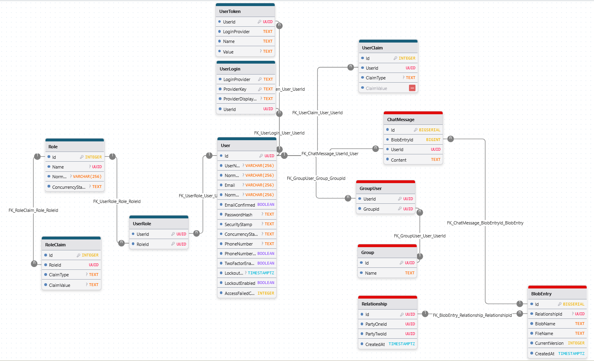

## Diagrama de Contexto

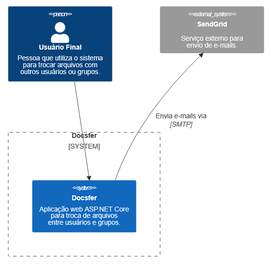

## Diagrama de Contêiner

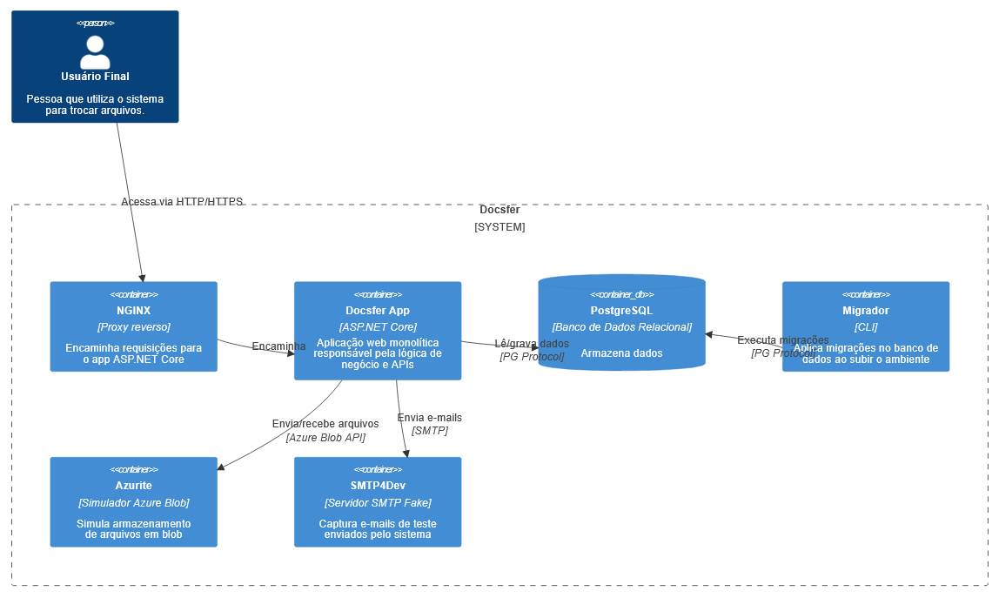

## Diagrama de Componentes

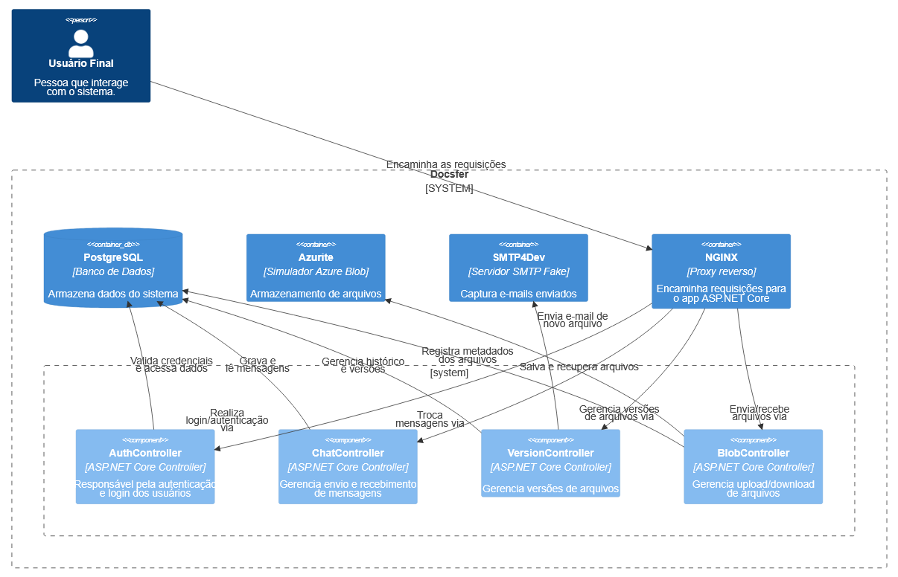

## Diagrama de Classes

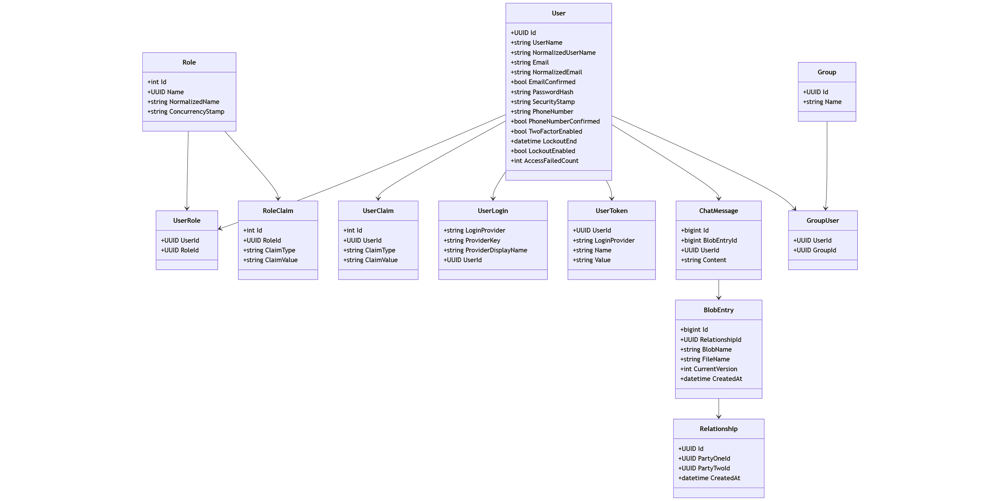

## Desenvolvimento

Para preparar o ambiente de desenvolvimento é necessário os seguintes pré-requisitos:

- Docker e Docker Compose *ou* Podman e Podman Compose

Assim que atender aos requisitos:

- Execute o sistema com `docker compose up -d` ou `podman compose up -d`
- Entre na URL [http://localhost](http://localhost)

Isso vai subir o ambiente completo, sendo tal:

- Proxy e Servidor Web (nginx)
- Azure Blob Storage Local (azurite)
- Banco de Dados (postgres)
- Migrador de Banco de Dados (migrator)
- Back-end (backend)

## Prints das principais telas

### Login

O Login funciona como esperado, após a criação de uma conta, é possível logar. No caso da empresa, será apenas utilizado o botão "Entrar com EntraID"

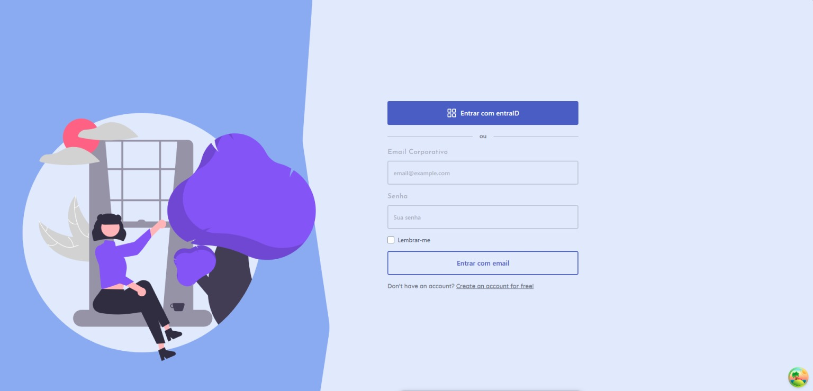

### Dashboard

No Dashboard é possível ter um panorama geral de como anda o ambiente.

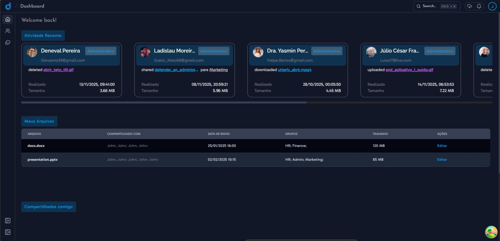

### Compartilhar Arquivos

Essa modal é o coração da aplicação, é o lugar onde será compartilhado os arquivos com outros usuários e grupos.

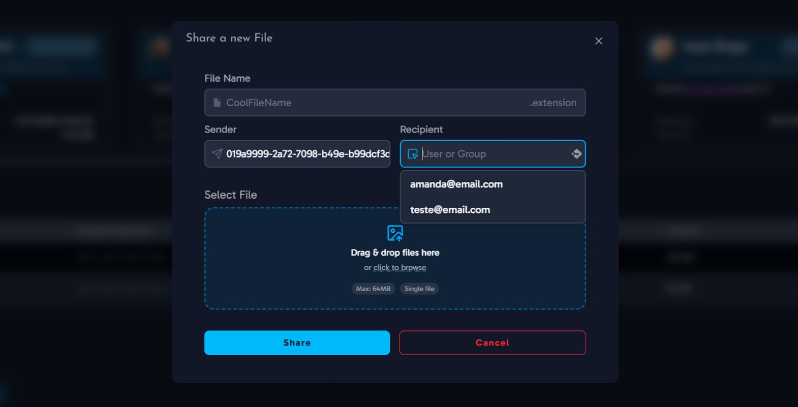

### CmdK

CmdK é um método de pesquisa rápida entre arquivos, usuários, grupos, etc.

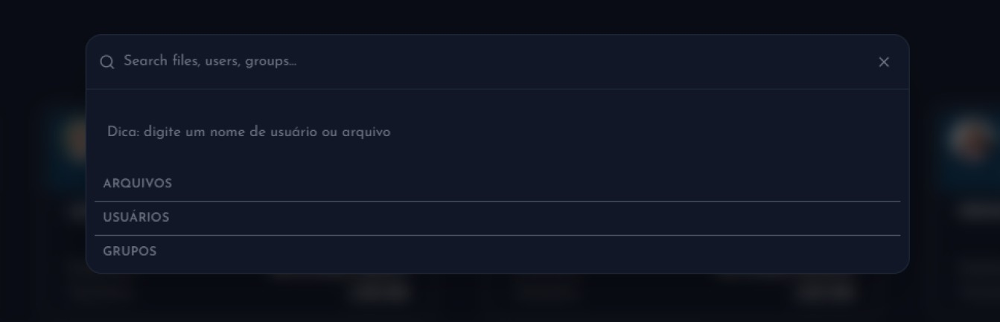

### Relacionamentos

Na tela de relacionamentos é possível criar uma amizade com usuário ou vínculo com grupo.

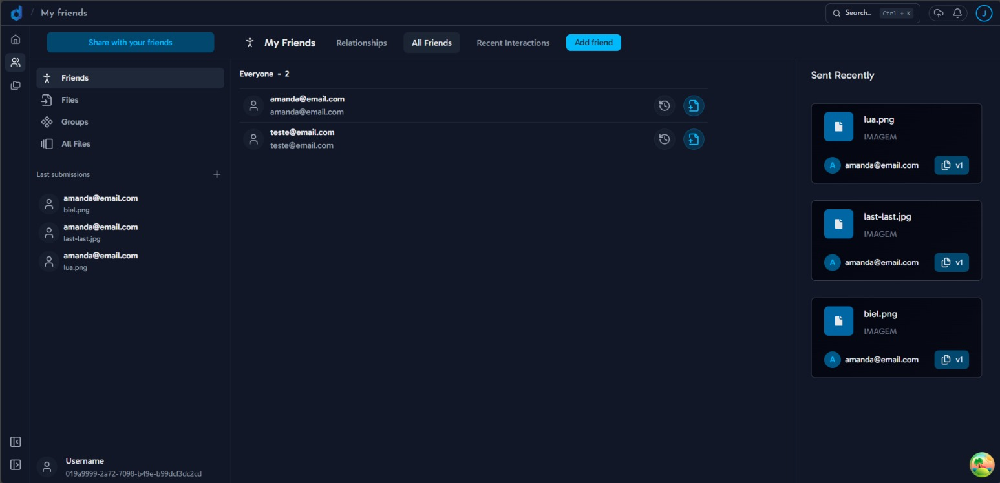

### Adicionar amigo

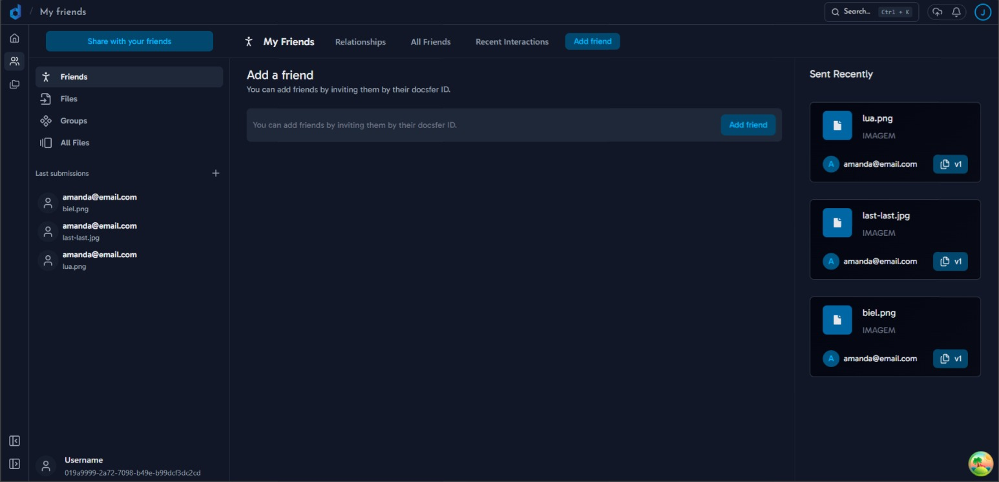

### Todos os arquivos

Nessa tela é possível averiguar todos os arquivos compartilhados.

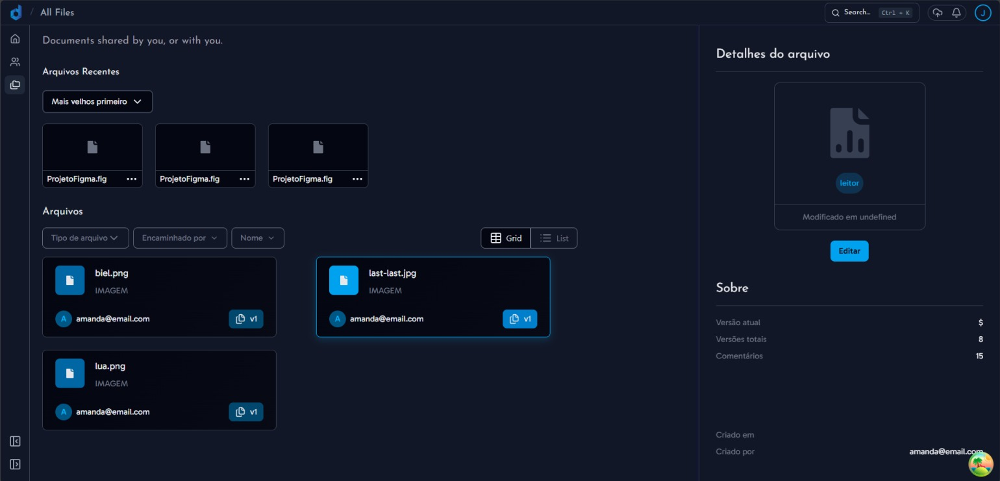

<!-- ### Meus Grupos

Nessa tela é possível verificar em que grupos você está, e colocar usuários extras neles.

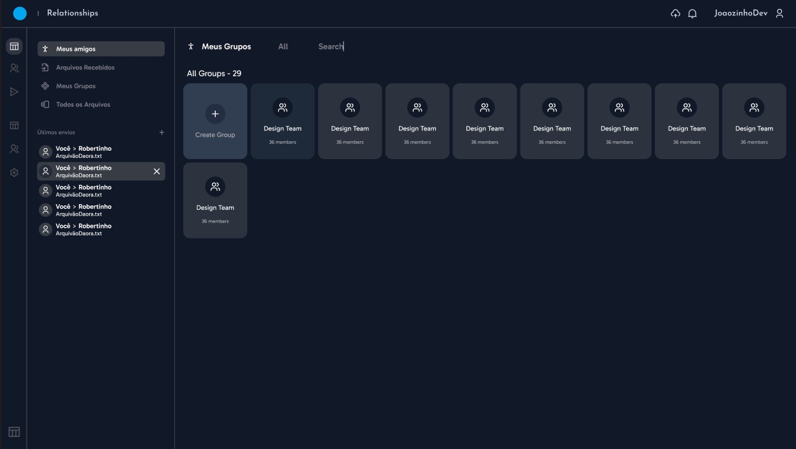 -->
